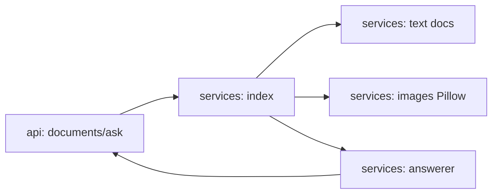

# multimodal-rag

[](https://github.com/Shamanchi/multimodal-rag/actions/workflows/ci.yml)
[](https://www.python.org/)
[](./Dockerfile)
[](./LICENSE)

> **English TL;DR:** FastAPI multimodal RAG: text documents plus images (user caption + auto Pillow features) in one keyword index, answers with [text-N]/[image-N] citations. Fully offline, no tokens needed.

Мультимодальный RAG: текстовые документы плюс картинки (подпись пользователя + автопризнаки Pillow) в одном keyword-индексе, ответы с цитатами [text-N]/[image-N]. Работает офлайн.

Источник темы: `Hands-On-AI-Engineering / P-153 (multimodal/multimodal_rag)` — идею и постановку взяли из каталога, код и тексты написаны с нуля.

## Какую задачу решает

Нужно искать сразу по текстам и картинкам: агент индексирует документы обоих типов, по вопросу находит релевантные чанки обоих модальностей и собирает ответ с указанием источников.

## Архитектура



Слои: `api/` → `services/` → `core/`, настройки через `pydantic-settings`.

## Быстрый старт

```bash
cp .env.example .env
pip install -r requirements.txt
uvicorn app.main:app --reload
curl -X POST http://127.0.0.1:8000/api/v1/documents -H "Content-Type: application/json" -d "{\"kind\": \"text\", \"title\": \"pgvector\", \"content\": \"IVFFlat suits medium collections.\"}"
curl -X POST http://127.0.0.1:8000/api/v1/ask -H "Content-Type: application/json" -d "{\"question\": \"Which index for medium collections?\"}"
```

Docker:

```bash
docker compose up --build
```

## API

- `GET /api/v1/health` — проверка сервиса.
- `POST /api/v1/documents` — текстовый документ. Тело: `{"kind": "text", "title": "...", "content": "..."}`.
- `POST /api/v1/images` — картинка (multipart) + `caption`. Автопризнаки добавляются к подписи.
- `GET /api/v1/documents` — все документы индекса.
- `POST /api/v1/ask` — вопрос. Тело: `{"question": "..."}`. Ответ: `answer` + `citations` ([text-N]/[image-N]).

Пример ответа `ask` (сокращённо):

```json
{
  "question": "...",
  "answer": "IVFFlat suits medium collections [text-1].",
  "citations": [{"ref": "text-1", "title": "pgvector"}]
}
```

## Переменные окружения (.env)

| Переменная | Назначение | По умолчанию |
|---|---|---|
| `TOP_K` | Документов в ответе | `3` |
| `MIN_SCORE` | Минимальный скор | `1.0` |
| `MAX_IMAGE_MB` | Макс. размер картинки (МБ) | `10` |
| `APP_HOST` / `APP_PORT` | Хост/порт API | `0.0.0.0` / `8000` |

Полный список — в [.env.example](./.env.example).

## Тесты

```bash
pip install -r requirements.txt
pytest -q
pytest -q -m integration
```

Unit-тесты без сети. Интеграционные (`-m integration`) — через TestClient, тоже без сети.

## Контакты

- Telegram: @PavelYrevichh
- Email: Lietman46@mail.ru
- GitHub: Shamanchi
- FL.ru: https://www.fl.ru/users/Shamanchi
